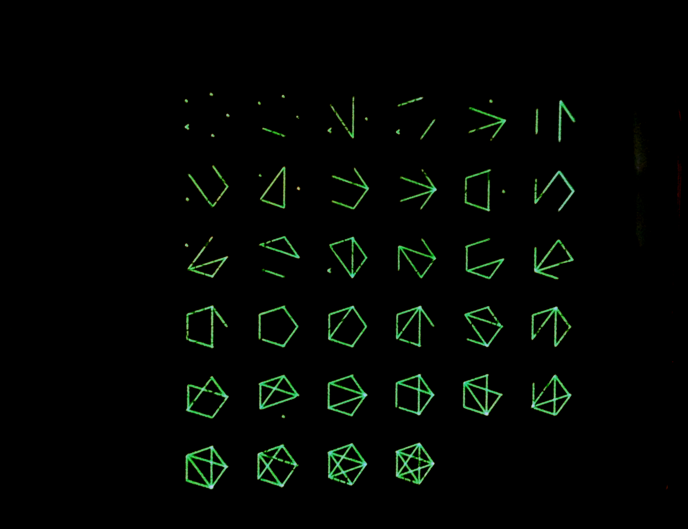

# Vector generator

Copyright (C) 2017-2022 Toby Thain <toby@telegraphics.com.au>

## Purpose

This circuit is designed to produce X, Y and Z (blanking) signals
for an analog CRT such as an oscilloscope or XY monitor.

It is controlled by a microcontroller using one digital input
and 12 digital outputs. The speed of the microcontroller is not
critical to the design; all timing critical functions are executed
in hardware.

## Output specifications

### Monitors tested

* Tektronix 602, 603, 604, 606

## Graphic capabilities

* Positioning to 12 bit precision
* Lines (approx 20,000 short-medium vectors per second[1];
  10,000 "long" vectors per second[2])
  - dashed lines (dashing defined by 30 bit vector)
  - speed can be increased further by adjusting integrator passives
    and software optimisations
* Points (37,000-60,000 per second at 0.6µs dwell;
  variable brightness by adjusting dwell time)

[1] "boxes" benchmark
[2] "square" benchmark

Above figures assume:
- integrator input resistor 15 kOhm (this can be decreased, e.g. 4.7kOhm)
- integrator capacitor 10nF
- maximum slew rate approx 0.015 V/µs or draw full deflection in 66µs

## Microcontroller options

Dev board with Arduino Uno pinout. Pins provided for 5V inputs
or level shifted 3.3V inputs.

### Tested ports

* NXP Freedom KE06Z modified for 5V

### Planned ports

* Arduino Duemilanove, Uno
* STM32G474RE (3.3V)
* Adafruit M4 Express

## Power supply

Bipolar +5/-5V. Current approx 30mA (15mA excluding power LED).

Suitable supply from AC mains is Dura Micro MD5122-A1.

## Principle of operation

## Output examples/demos

## Modifications

## Other applications

## Version history

* The first version of the board was produced in a batch of 5 by JLCPCB,
  May 2022. These were all claimed by friends and supporters
  even before the PCBs were delivered.

Original design was conceived in 2017/18.

## Future plans

## Credits

I had assistance from many people, mostly via irc, including:

* `joe_z` & `Wohali` with far greater analog expertise
* `larsb`, who encouraged me to build this as an avenue for using real
  vector displays with software emulators of historical computers
* `asjackson`, fellow hacker and friend
* `genii`, who drilled many holes to work around a position defect
  on the first PCB version

## Dedication

Dedicated to my friend `bootnecklad`, 1995–2018.
