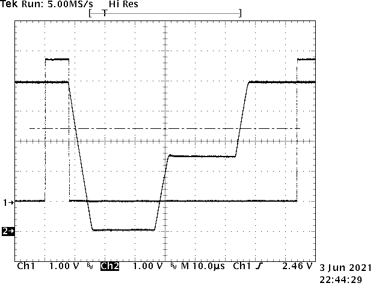
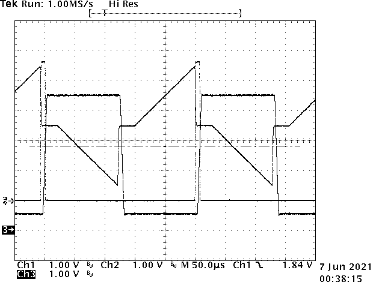

# Board assembly

## General

- Test points can be installed as needed;
  1.2mm holes suit Digikey 36-4952-ND
- IC orientations are consistent, pin 1 to left looking at front
  with power connection at right.

## Power

- Modular power supply is +5/-5V, Dura Micro MD5122-A1
- Connector J6
- R2: 330R or 270R
- LED D1
- test with +5V & GND on J6
- C6, C8: 100µF electrolytic

## Voltage reference

- U13 LM336
- R1 2.2k
- with power applied, check VREF2.5 test point

## 5V MCU

- install J7, J8, J9, J10
  - Only the 2 GND pins need be soldered for J7

## 3.3V MCU

- install J1, J2, J3, J5
  - Only the 2 GND pins need be soldered for J1
- install U16, U17 level shifting buffers
- install their decoupling caps C19, C20
- install RN2, R29, R30, R33, R3, R28

## Coefficient DACs

- install U1 MCP4922
- check levels with step voltage program (Test 1)

## Integrators

- install U6 - tested with MCP6292
  - needs to be R2R output at least, does not need to be fast, as slew rates are < 0.05V/µs
- caps C11 and C12 must be matched closely.
  - I use an RC Schmitt oscillator and frequency counter to get relative values,
    sort, and take closest pairs.
- install R5, R7
  - these should be closely matched
  - tested between 4.7k (fast) and 15k (slow); should work even faster
    but with more timing error and noise susceptibility (I think)
- install R4, R6
- in first version of PCB there is a bug that leaves U6 Vss/Vdd pins floating
  and U5 Vdd floating:
  - install jumper instead of C10, this connects U6 Vdd to GND
  - install C9, and wire between +5V pin of C9 and +5V rail,
    e.g. + pin of C6, or +5V pin of power inlet connector.

## Switches

- install U5 SN74LV4066AN
- install R34, R35 47R - current limiting resistors
- check integrator run and reset with test program (Test program 2)

## Rest of assembly

- R21: 22k 5%, Z output follower emitter resistor
- R26, R27: 2.2k 5%, pullups for comparators
- Q1: 2N3904 Z follower
- R12, R13: do not install unless needed - provides hysteresis to comparators. Nominal 100kOhm
- C13, C14, C17, C18: Vref filter caps - 1µF but could be increased to 4.7µF later?
- R16: 10kOhm Z divider
- C22, C21, C15, C16, C3, C4, C5, C7, C9, C1, C2: 1µF decoupling caps
- R8, R22: Matched pair which divide Vref to a position offset voltage, can be 15k or 33k
  - In fact the matching doesn't matter very much since the position is user adjustable on the monitor
  - This divider could be a pot if a position adjustment were desired on this board
- R10, R23: Same
- R9, R11: Do not install
- R17, R18: 33k, pair with matched values
- R24: arbitrary 15k
- R19, R20: 33k, pair with matched values
- R25: 15k selected so that ratio of R25 : (R19+R20) closely matches ratio of R24 : (R17+R18)
  - this should make the X and Y gain roughly equal
